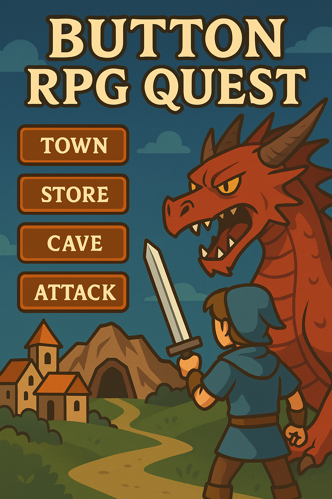

# 🧙‍♂️ Button RPG Quest

Welcome to **Button RPG Quest** — a fun, browser-based click-driven RPG where you slay monsters, earn gold, and defeat a fearsome dragon... all with the power of JavaScript and buttons!



---

## 🎮 Game Features

- 🏰 Explore different locations: Town Square, Store, and Cave
- 🗡️ Upgrade your weapon from a humble stick to a mighty sword
- 🐉 Battle monsters: Slime, Fanged Beast, and the final boss — The Dragon
- 🧪 Buy health, manage inventory, and survive epic fights
- 🥚 Includes a hidden **easter egg game**!

---

## 🚀 Tech Stack

- **HTML** — Structure of the game
- **CSS** — Styling and layout
- **JavaScript** — Core game logic and interactivity (vanilla!)

---

## 📦 How to Run

1. Clone this repo:
   ```bash
   git clone https://github.com/your-username/button-rpg-quest.git
   ```
2. Open `index.html` in your favorite browser.

   Or just double-click it. No build steps. No dependencies. Pure fun.

---

## 📁 Project Structure

```plaintext
button-rpg-quest/
├── index.html                        # Main HTML file
├── style.css                         # Game styling
├── script.js                         # Game logic
├── button-rpg-quest-game-cover.png   # Cover art for the game
├── README.md                         # Project documentation
├── LICENSE                           # Open-source license (MIT)
└── .gitignore                        # Git ignore file
```

---

## 🛠️ Future Improvements (Ideas)

- Save/load progress
- Add more enemies and locations
- Sound effects and music
- Responsive design for mobile

---

## 🧑‍💻 Author

Made with 💛 by **Sekander Dany**  
Inspired by browser RPGs, and built to explore JavaScript magic.

---

## 📜 License

This project is licensed under the [MIT License](LICENSE).

---

> _"Do you hear the dragon's roar? Grab your stick, brave warrior."_ 🐲
